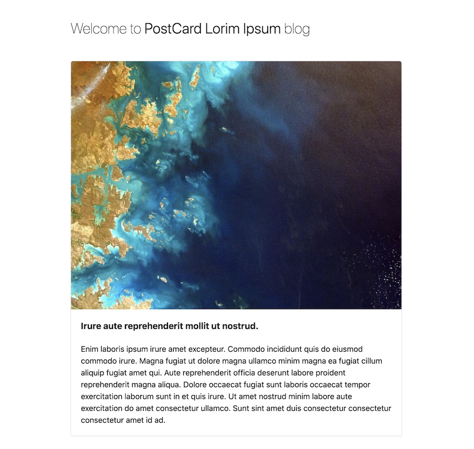

# Next.js + Tailwind CSS PostCard Lorim Ipsum blog challenge 🚀 

The goal of this challenge is to provide a baseline for candidates to experience React, Next.js and Tailwind CSS environment while being able to validate technical and autonomy skills.

There is a set of tasks you need to complete to finish the challenge. Most of them are simple changes to the existing code base, however as you progress through the challenge, you will face more challenging tasks.

Please take the time to read the instructions below before starting.


## How?

You will be assigned this challenge. You MUST fork this repository into your own space and then start developing these tasks. Once finished, you should open a Pull Request. 

### Why? 

Glad you asked! Because we're going to start a little peer code review there. We will be able to talk and understand a little more about your process.
The whole idea is for you and for us to understand if we are able to communicate and collaborate together.


## Criteria ✅

- For each task you must assign at least one commit
- You should fork this repo to your own space and use GitHub (or GitLab, etc)
- Do not merge your code into master, always open a pull request!
- You can (and should) research solutions to help you complete your task
- For each task, we assign a number of points out of a total of 30
- We will reduce 1 point for each day of delay 💣
- You will have 2 weeks to complete the challenge
- Last but not least: enjoy and have fun building your solution! 😀

Whenever you have any questions, get in touch.


## Technologies 📖

We use [TypeScript](https://www.typescriptlang.org/) as our *lingua-franca* (just kidding! 🙃) and this is the language used in this challenge and we hope you'll write in TypeScript too. If you don't know it, don't worry, it's very similar to JavaScript/ECMAScript but with `types` (which is awesome and saves us some tedious time on debugging broken things!).

This is a [Next.js](https://nextjs.org/) project bootstrapped with [`create-next-app`](https://github.com/vercel/next.js/tree/canary/packages/create-next-app) which in turn uses [React](https://reactjs.org/) to render components. As a CSS framework we choose [Tailwind CSS](https://tailwindcss.com/) for its versatility, good integration with the existing ecosystem and integrated tools that help us to develop faster.


## The Gist ✨

The objective is to have a new simple blog website using React that uses an existing API (provided by the customer).
This new site should feature a simple header, a summary of blog posts with a load more button, and a simple copyright footer.


## What is already in place 🔋

- Fully functional Next.js application with all necessary dependencies (except for the optional dependency in Task 5)
- Tailwind CSS already integrated
- A functional API of lorem ipsum blog posts
- Everything you need to get started whenever you want!

## Tasks 🏁

### 1. First Run 
 

*Points: 2*

First, we need to get ready to start building. Fork this repo to your own space and clone it using `git clone` command (or any other git tool you are familiar with).

Install all `npm` dependencies and open your favorite editor.

Now, start the development server using ```npm run dev```.
Open [http://localhost:3000](http://localhost:3000) with your browser to see the result.

Now take a look at the codebase and make sure you are familiar with it.

If you need to, you can learn more about Next.js. Take a look at the following resources:

- [Next.js Documentation](https://nextjs.org/docs) - learn about Next.js features and API.
- [Learn Next.js](https://nextjs.org/learn) - an interactive Next.js tutorial.


### 2. Styling with Tailwind CSS
 

*Points: 4*

Now, this time, we need to add some CSS to the PostCard component (the one that renders post summaries).

As you already know, we use *Tailwind CSS* to style our codebase. Make sure you have [Tailwind CSS Docs](https://tailwindcss.com/docs) always opened, because you will need it.

Try making the ```<PostCard />``` similar to the mockup you find at the top of this page, using just Tailwind CSS classes.

Center the posts container and make sure it doesn't grow larger than the `md` size of the screen. You can find how to do it  in the documentation.


### 3. Simple Header
 

*Points: 6*

Let's create a simple React component that should render the blog name in the upper left corner and a simple menu on the right. The menu should only have a link to the home page and should be called `Home`. This component must be placed on the `_app.ts` page.

Apply some margins that must be consistent to the existing design. Make sure it works well on mobile devices.


### 4. About us page
 

*Points: 8* 

Now that we have an ```<Header />``` component, we want to add an `About Us` page. This is a simple static page that should be added to the `pages` directory. Make sure you know how to add this new page by going to Next.js Documentation. It's very simple and straightforward!

The width of this page must be the same size as the blog listing page and must be 2 lorem ipsum paragraphs and at least one image.

You are free to add anything you like.


### 5. Blog post page
 

*Points: 10*

This is the last and most exhausting task of all, but the most fun to do for me. 😄

The idea is to add a dynamic Next.js page that renders each blog post. 

If you look at the `Post` interface, you'll see that it has all the properties you need to design and build a great blog post:
```ts
interface Post {
  id: string;
  title: string;
  picture: Picture;
  excerpt: string;
  content: string;
  author: Author;
  tags: Tag[];
  comments: Comment[];
}
```
Make sure you explore each property and understand what it contains and what can be used.

The feature picture should appear in the header. Take into account different rendering dimensions for different devices. The `picture` property already returns three different sizes of the same image:
```ts
interface Picture {
  thumbnail: string;
  medium: string;
  large: string;
}
```
Make sure you use this one well! 😉

**The API**

The API resides on the same domain and port, but on a different path. Just go to [http://localhost:3000/api](http://localhost:3000/api) to see it.

It already has a route that returns a blog post or 404 if the post is not found. Head to `/api/posts/<slug>` to fetch just one post.

**Note:** You can use `getServerSideProps` instead of `getStaticProps` to fetch the API blog post.

Add a link for each ```<PostCard />``` to its corresponding URI.

#### Notes:
- The body of the post should be legible. There is a Tailwind plugin called [Typography](https://github.com/tailwindlabs/tailwindcss-typography) that can help you a lot here! It's up to you to use it or not.
- Consider any accessibility aids you can provide, for example using HTML semantics or color contrasts.


## Final thoughts 💡

I hope you enjoy taking up this challenge. Most of the things you use and build here are our daily activities (albeit on a large scale).

Make sure your code is clean and understandable. Do not merge your pull request!

Happy coding! 🤓 🥳
